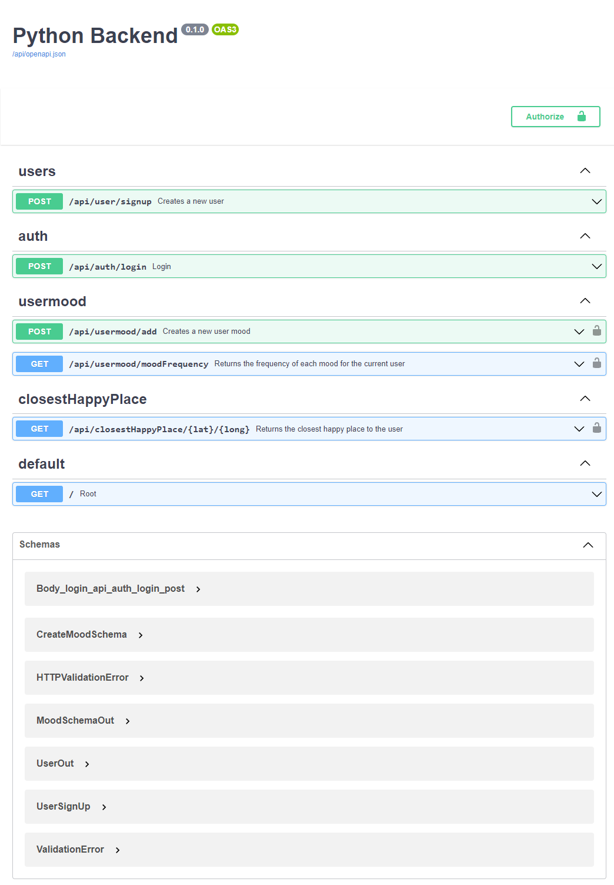
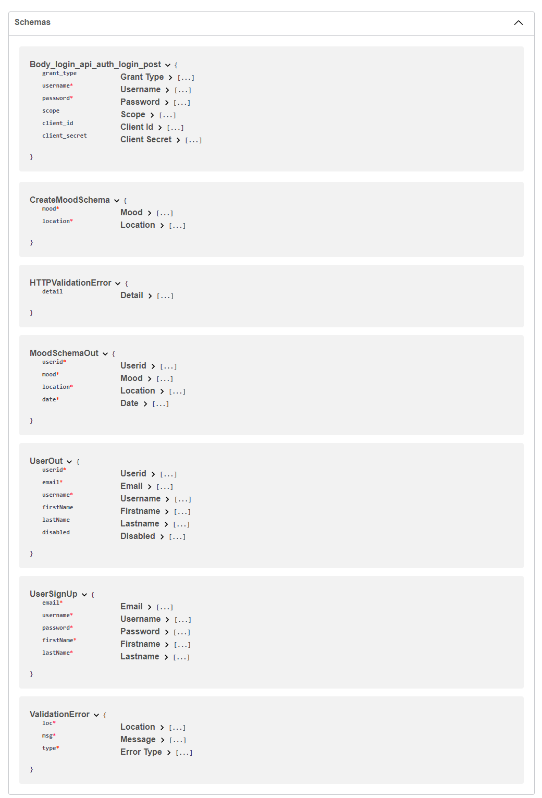
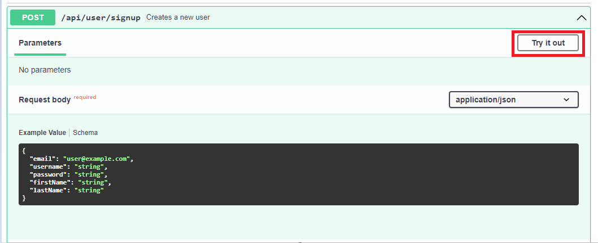
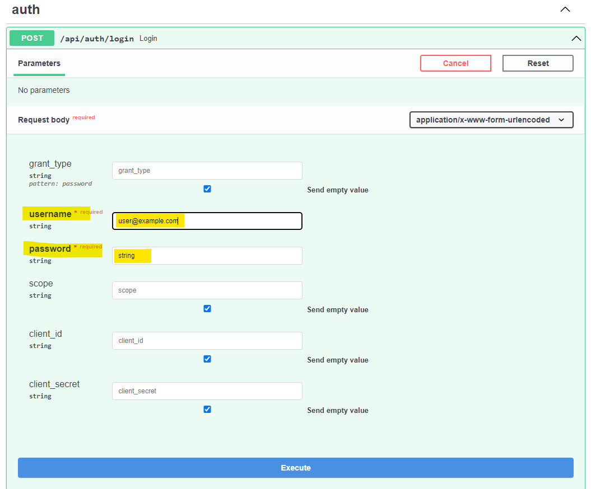
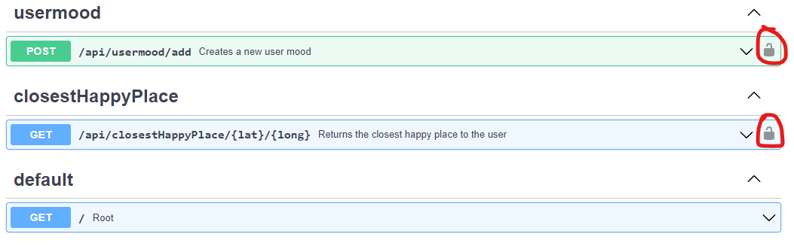
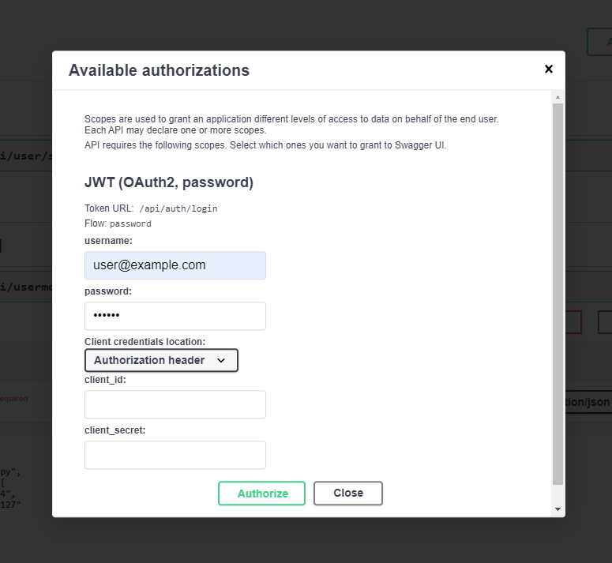
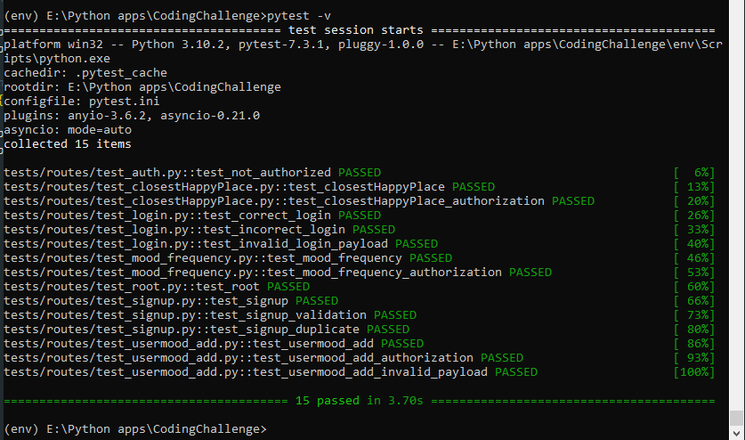

# Mood Sensing App Backend

## Intro

I have built the backend using Python async micro framework [FastAPI](https://fastapi.tiangolo.com/) and [MongoDB]() store with the following features:

- [x] User Sign Up
- [x] Login
- [x] JWT authentication and authorization
- [x] Get closest happy place along with place details from google maps
- [x] Return mood frequency of the user
- [x] Unit Tests
- [x] Input Validation
- [x] Validating tokens on each request to ensure authentication

It's built on top of these libraries to provide those features:

- [Beanie ODM](https://github.com/roman-right/beanie) - Async [MongoDB](https://www.mongodb.com/atlas/database) object-document mapper built on [PyDantic](https://pydantic-docs.helpmanual.io/)
- [googlemaps](https://googlemaps.github.io/google-maps-services-python/docs/) - Python Client for Google Maps Services. I have used GCP API services which allow upto 4000 free requests per day which is plenty for this project. I have used following 3 API services
  - [Geocoding API](https://developers.google.com/maps/documentation/geocoding/overview) - Converts between addresses and geographic coordinates.
  - [Places API](https://developers.google.com/maps/documentation/places/web-service/overview) - Gets data from the same database used by Google Maps. Places features over 100 million businesses and points of interest that are updated frequently through owner-verified listings and user-moderated contributions.
  - [Distance Matrix API](https://developers.google.com/maps/documentation/distance-matrix/overview) - Provides travel time and distance for multiple destinations.
- [passlib[brcypt]](https://developers.google.com/maps/documentation/distance-matrix/overview) - Used to implement the BCrypt password hash.
- [python-jose[cryptograpy]](https://pypi.org/project/python-jose/) - To generate and verify the JWT tokens in Python
- [scipy](https://docs.scipy.org/doc/scipy/index.html) - Used [Scipy KD Tree](https://docs.scipy.org/doc/scipy/reference/generated/scipy.spatial.KDTree.html#scipy-spatial-kdtree) for quick nearest-neighbour lookup to efficiently find nearest location among list of locations to a target location.
- [httpx](https://www.python-httpx.org/) and [pytest-asyncio](https://github.com/pytest-dev/pytest-asyncio) - For Unit Testing

## Project File Structure

The project follows the following file structure:

```bash
.
├── app/
│   ├── .env
│   ├── main.py
│   ├── api/
│   │   ├── router.py
│   │   ├── __init__.py
│   │   ├── auth/
│   │   │   ├── auth.py
│   │   │   ├── user_deps.py
│   │   │   └── __init__.py
│   │   └── handlers/
│   │       ├── closest_happy_place.py
│   │       ├── user.py
│   │       ├── user_mood.py
│   │       └── __init__.py
│   ├── core/
│   │   ├── config.py
│   │   ├── security.py
│   │   └── __init__.py
│   ├── models/
│   │   ├── userModel.py
│   │   ├── usermood_model.py
│   │   └── __init__.py
│   ├── schemas/
│   │   ├── auth_schema.py
│   │   ├── usermood_schema.py
│   │   ├── userSchema.py
│   │   └── __init__.py
│   └── services/
│       ├── usermood_service.py
│       ├── userService.py
│       └── __init__.py
├── tests/
│   ├── conftest.py
│   ├── util.py
│   └── __init__.py/
│       └── routes/
│           ├── test_auth.py
│           ├── test_closestHappyPlace.py
│           ├── test_login.py
│           ├── test_root.py
│           ├── test_signup.py
│           ├── test_usermood_add.py
│           └── __init__.py
├── Dockerfile
├── pytest.ini
└── requirements.txt
```

The `app/` directory contains the main files and directories for your Fast API application.

- `.env` file: This file is used for environment variables and configuration settings.
- `main.py`: This is the main entry point for your Fast API application.
- `api/` directory: It contains the API-related files and directories.
  - `router.py`: This file defines the API routers and their corresponding endpoints.
  - `auth/` directory: It includes files related to authentication.
    - `auth.py`: This file contains authentication-related functions or classes.
    - `user_deps.py`: It defines the dependencies for user authentication.
  - `handlers/` directory: It contains handler functions for API endpoints.
    - `closest_happy_place.py`: This file defines a handler for the "closest happy place" endpoint.
    - `user.py`: This file defines a handler for user-related endpoints.
    - `user_mood.py`: This file defines a handler for user mood-related endpoints.
- `core/` directory: It includes core application files and utilities.
  - `config.py`: This file contains configuration settings for your application like API Keys, DB connection strings, Token expiration time etc.
  - `security.py`: It provides security-related functions or classes for JWT token creation and Password Hashing.
- `models/` directory: It contains database models or ORM (Object-Relational Mapping) files.
  - `userModel.py`: This file defines the user model.
  - `usermood_model.py`: This file defines the user mood model.
- `schemas/` directory: It includes Pydantic schemas for request and response validation.
  - `auth_schema.py`: This file defines schemas related to authentication - Signup, Login.
  - `usermood_schema.py`: This file defines schemas related to user mood.
  - `userSchema.py`: This file defines schemas related to users.
- `services/` directory: It contains service files that handle business logic and querying DB.
  - `usermood_service.py`: This file provides services related to user moods.
  - `userService.py`: This file provides services related to users.
- The `tests/` directory includes test files for your application.
  - `conftest.py`: This file contains configurations or fixtures for tests.
  - `util.py`: It provides utility functions or classes for tests, getting test users, creating test data.
  - `routes/` directory: It includes test files for different API routes.

The `__init__.py` file in each directory makes the directory a Python package and allows us to define initialization code, import modules, or perform other setup tasks specific to that package.

## Setup

To set up and run this Fast API project, follow these steps:

## Prerequisites

- Python 3.7 or higher installed on your system.

1. Navigate to the project directory
2. Create and activate a virtual environment:
   ```shell
   python -m virtualenv env
   env\Scripts\activate
   ```
3. Install the project dependencies:
   ```shell
   pip install -r requirements.txt
   ```

## Configuration

You may use as is or add the necessary environment variables to the .env file to adjust the values according to your setup. For example

- You may want to check the MONGO_CONNECTION_STRING which is set to default locahost server url mongodb://localhost:27017/.
- You dont have to create the main and test databases. The main database will be created automatically when server is started. The test database will be created when running test cases.
- You may use the same Google Maps API key for testing. GCP Maps API allows free 4000 requests per day which is plenty for this project, although I have safegaurded with necessary restrictions to prevent over use.

## Running the Application

1. Start the Fast API development server:

```shell
uvicorn app.main:app --reload
```

The API will be accessible at http://localhost:8000. 2. Open your browser and navigate to `http://localhost:800

## Accessing the Documentation

Fast API comes with super cool built-in support for automatic documentation generation. It leverages the OpenAPI standard and generates interactive API documentation that can be accessed through a web browser. The documentation provides detailed information about your API endpoints, request/response models, and available routes.

Once the Fast API application is running, you can access the automatically generated documentation by navigating to the /docs endpoint in your web browser. For example, if you are running the application locally, you can access the documentation at http://localhost:8000/docs.



## Data Models and Schemas

### > Assumptions made

- According to the problem statement, I have assumed that a user takes a picture on their phone at place they visit. A ML model will classify the image according to the mood of user as happy, neutral or sad.
- The backend receives a POST request to `api/usermood/add` API endpoint with mood and location information as latitude and longitude. The API saves the data along with user object in the MongoDB database in user_moods collection.
- The backend later receives a GET request to `api/closestHappyPlace/{lat}/{long}` API end-point with latitude and longitude of user's current location. The API then sends the closest place where user was last seen happy.
  - The API queries for locations where user was last seen happy.
  - Then I've used scipy's KDtree algorithm which can efficiently provide the nearest neighboring location among all the locations obtained from the query.
  - Further I have used Google Maps API using python API client library to get details about the location and return distance, name and address as response.
- The backend then receives a GET request to `api/usermood/moodFrequency` API end-point, which queries database user_moods collection and return mood frequency distribution for the particular user
- All 3 APIs are protected and requires authorizations.
  Here's a sample document from `users` collection from db

```
{
    "_id" : ObjectId("645748897dacf1e04f8959bf"),
    "userid" : UUID("236e2c31-7302-4ad0-94cd-a56bc53a449e"),
    "username" : "jd_21",
    "email" : "test@test.com",
    "hashedPassword" : "$2b$12$S/4SnS6ZawV1bDaISBaa7u54jvfnw3LU8ZI5tAPLUnTAjy6V3IbGq",
    "firstName" : "John",
    "lastName" : "Doe",
    "disabled" : null
}
```

Here's a sample document from `user_moods` collection from db

```
{
    "_id" : ObjectId("6459f74c047fc1356fe0ade8"),
    "user" : DBRef("users", ObjectId("6457f62a1e1b16a4b8df214d")),
    "mood" : "happy",
    "location" : [
        37.3366834,
        -121.8894127
    ],
    "date" : ISODate("2023-05-09T07:33:32.273+0000")
}
```

### > Schemas

The schemas defined can be seen in bottom of the FastAPI docs page.


## Executing API

### > Sign Up end-point

Expand the API end point you want to execute, and click on the "Try Out!" button. The documentation will display an interactive form for inputting the request payload or parameters.

Following is an example for Sign Up end point



### > Login end-point

For login is little different than other post endpoints. For this we use FastAPI OAuth2PasswordRequestForm which takes form data with username and password fields. <b>Enter email instead of username</b>. I am not able to username to email in the form display as of moment. The [spec](https://fastapi.tiangolo.com/tutorial/security/simple-oauth2/) says that the fields have to be named like that. So user-name or email wouldn't work.

<b><i>Please enter email instead of username in the form and it's password</i></b>



Server Response will have the JWT access and refresh tokens


### > Executing Protected endpoints

- The protected endpoints will need JWT access token to authorize the requests. In the fastAPI docs, you'll see a 🔒 in front of it.

- In the project I have protected usermood add and closestHappyPlace end points.
  

- To execute these end points, you need to click on "Authorize" button on top right of the doc page and enter the <b>email</b> and <b>password</b> int the form as shown below.

  

## Unit Test

To run the test cases, follow these steps:

1. Open a terminal or command prompt and navigate to the root directory of your project.

2. Run the following command to execute the tests using pytest:

```shell
pytest -v
```



3. On running pytest for the first time, a new "testdb" gets created, with required test data wherever needed.
